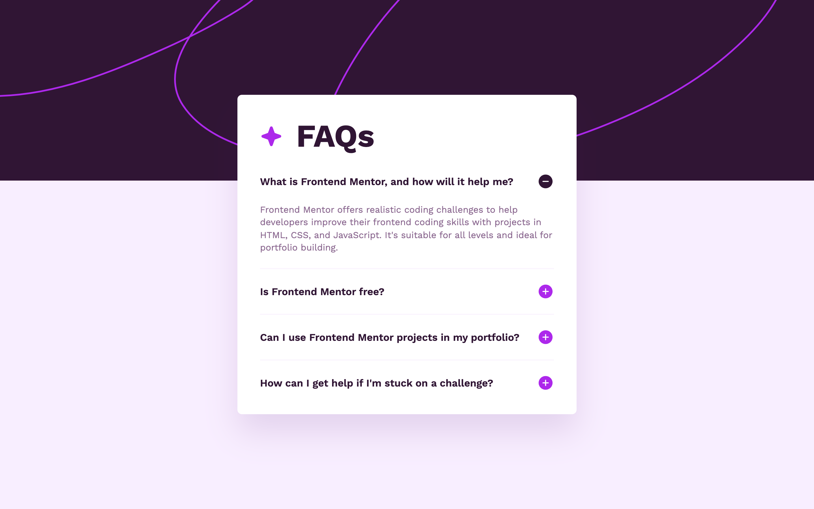

# Frontend Mentor - FAQ-Accordion

I coded this project myself with the challenge to make it more accessible for all kinds of users. The Design for it came from frontend Mentor. Frontend Mentor provides challenges for frontend developers so they can make projects without the problem of designing the project. [See the challenge on Frontend Mentor.](https://www.frontendmentor.io/challenges/faq-accordion-wyfFdeBwBz)

## The challenge

The challenge was to create an FAQ-Accordion that would be more accessible to all kinds of users. The accordion needs to open and close by clicking on it or using the space-bar or enter key on the keyboard. The icons need to change to indicate that a question is open or closed. Screen readers need to read out the page in a way that it is understandable. The design needs to change for each type of device that's being used.

## Screenshots

  

## My experience

It was interesting to make this FAQ-Accordion more accessible. I learned a lot from this challenge. Not only the process of making it more accessible was educational. I made for the first time a custom made pointer. Now when you hover over the FAQ items if your on a laptop or desktop you can see the custom pointer.

### Links

-   Solution URL: [github repository](https://github.com/Jolijn0101/faq-accordion)
-   Live Site URL: [github page](https://jolijn0101.github.io/faq-accordion/)
